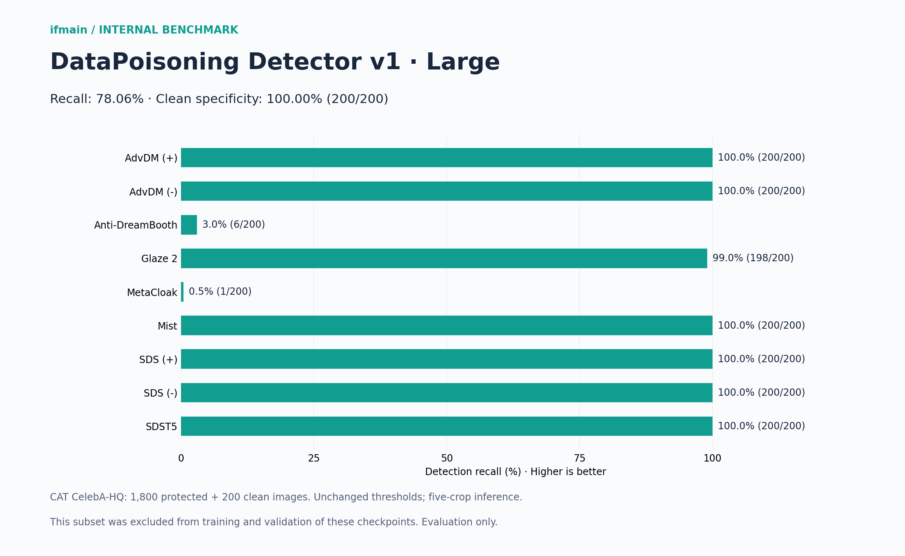
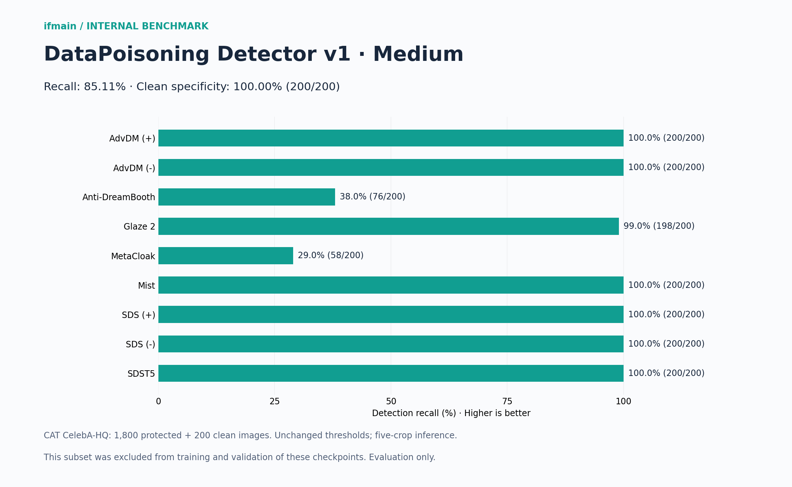
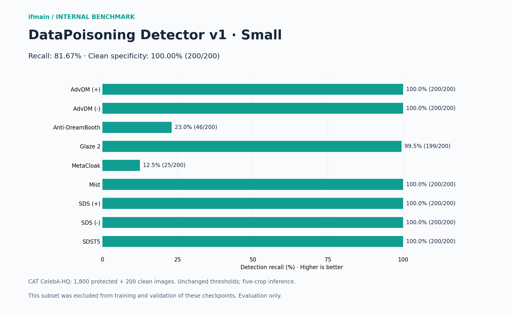
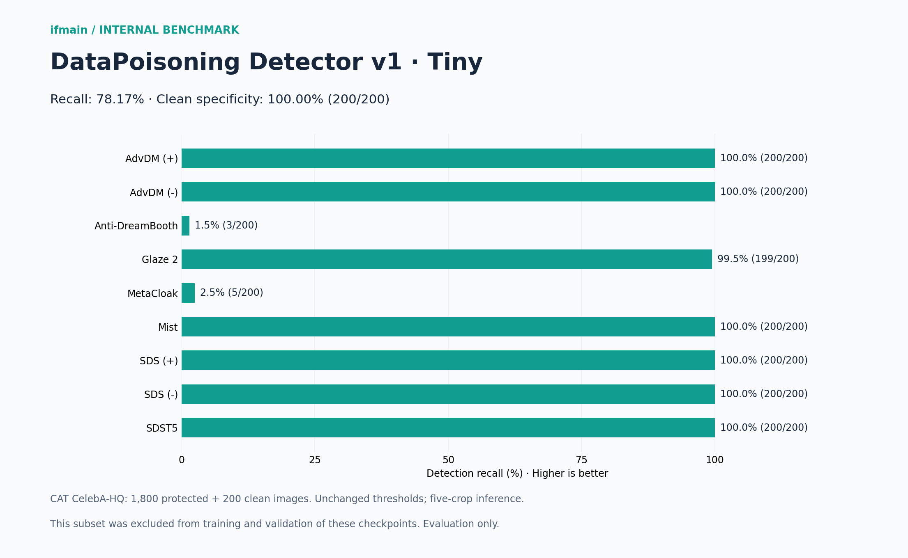

# DataPoisoning Detector v1

<!-- architecture-figures -->
## Architecture at a glance


Original diagrams for this release. Editable SVG versions: [architecture](assets/architecture.svg) · [inference and distillation](assets/inference-distillation.svg).
<!-- /architecture-figures -->


[Code and training](https://github.com/ifmain/datapoisoning-detector-v1) · [Evaluation reports](https://github.com/ifmain/datapoisoning-detector-v1/tree/main/reports/three_tap_run)

**Hugging Face models:** [Large](https://huggingface.co/ifmain/datapoisoning-detector-v1-large) · [Medium](https://huggingface.co/ifmain/datapoisoning-detector-v1-medium) · [Small](https://huggingface.co/ifmain/datapoisoning-detector-v1-small) · [Tiny](https://huggingface.co/ifmain/datapoisoning-detector-v1-tiny)

Install with `pip install -e .` (or `pip install -r requirements.txt`). For figure rendering, install `pip install ".[plots]"`. See [installation verification](docs/INSTALLATION.md). Run `python scripts/predict.py image.png --model ../hf-large --device cuda`. Training: `python scripts/train.py --help`; optional distillation uses `--teacher`, `--kd-weight 0.5`, `--temperature 2`.

The detector compares encoder blocks 1, 2 and 3 with the final posterior-mean representation of a frozen FLUX.2 VAE. Each stream is projected to an 8 × 8 token grid. The three early-to-final differences are fused with all four feature streams before transformer classification. Inputs are native-resolution 128 × 128 RGB crops with a central 96 × 96 active region. The VAE decoder and generative FLUX transformer are not used.

The training run excludes CelebA-HQ from training, validation and patch caches; it is used only for the separate internal evaluation below. It contains 21,464 training, 1,257 validation and 1,446 test records. Large starts with newly initialized trainable parameters and the licensed frozen VAE encoder. Students learn from this new Large through temperature-2 Bernoulli KL soft-target distillation: 50% distillation and 50% supervised classification plus paired ranking. Checkpoint selection uses validation recall at a target false-positive rate of 1%, with ROC-AUC as the tie-breaker. A decline receives two additional recovery epochs unless a sustained overfitting signal is observed.

Image-level inference averages five crop logits. Scores are not calibrated probabilities. All benchmark tables below use the internal CAT evaluation and unchanged release thresholds.

| Variant | Total parameters | Trainable parameters | Status |
|---|---:|---:|---:|
| [Large](https://huggingface.co/ifmain/datapoisoning-detector-v1-large) | 296,264,065 | 261,838,209 | Evaluated |
| [Medium](https://huggingface.co/ifmain/datapoisoning-detector-v1-medium) | 182,722,433 | 148,296,577 | Evaluated |
| [Small](https://huggingface.co/ifmain/datapoisoning-detector-v1-small) | 82,635,137 | 48,209,281 | Evaluated |
| [Tiny](https://huggingface.co/ifmain/datapoisoning-detector-v1-tiny) | 43,280,257 | 8,854,401 | Evaluated |

## Internal benchmark: CAT CelebA-HQ

All 2,000 eligible images in the archived subset: 200 per protection method and 200 clean controls. Noisy baseline excluded. **Original five-crop inference and unchanged release thresholds**, not experimental sliding-window calibration.

| [Large](https://huggingface.co/ifmain/datapoisoning-detector-v1-large) | [Medium](https://huggingface.co/ifmain/datapoisoning-detector-v1-medium) |
|:---:|:---:|
|  |  |
| **Small** | **Tiny** |
|  |  |

### Detection recall

Percentage of protected images correctly detected. Higher is better.

| Protection | [Large](https://huggingface.co/ifmain/datapoisoning-detector-v1-large) | [Medium](https://huggingface.co/ifmain/datapoisoning-detector-v1-medium) | [Small](https://huggingface.co/ifmain/datapoisoning-detector-v1-small) | [Tiny](https://huggingface.co/ifmain/datapoisoning-detector-v1-tiny) |
|---|---:|---:|---:|---:|
| advdm- | **100.00% (200/200)** | **100.00% (200/200)** | **100.00% (200/200)** | **100.00% (200/200)** |
| advdm+ | **100.00% (200/200)** | **100.00% (200/200)** | **100.00% (200/200)** | **100.00% (200/200)** |
| anti-dreambooth | 3.00% (6/200) | **38.00% (76/200)** | 23.00% (46/200) | 1.50% (3/200) |
| glaze2 | 99.00% (198/200) | 99.00% (198/200) | **99.50% (199/200)** | **99.50% (199/200)** |
| metacloak | 0.50% (1/200) | **29.00% (58/200)** | 12.50% (25/200) | 2.50% (5/200) |
| mist | **100.00% (200/200)** | **100.00% (200/200)** | **100.00% (200/200)** | **100.00% (200/200)** |
| sds- | **100.00% (200/200)** | **100.00% (200/200)** | **100.00% (200/200)** | **100.00% (200/200)** |
| sds+ | **100.00% (200/200)** | **100.00% (200/200)** | **100.00% (200/200)** | **100.00% (200/200)** |
| sdsT5 | **100.00% (200/200)** | **100.00% (200/200)** | **100.00% (200/200)** | **100.00% (200/200)** |

### Clean-image specificity

Percentage of clean images correctly accepted as clean. Higher is better. All models use the same 200 clean controls.

| Evaluation pool | [Large](https://huggingface.co/ifmain/datapoisoning-detector-v1-large) | [Medium](https://huggingface.co/ifmain/datapoisoning-detector-v1-medium) | [Small](https://huggingface.co/ifmain/datapoisoning-detector-v1-small) | [Tiny](https://huggingface.co/ifmain/datapoisoning-detector-v1-tiny) |
|---|---:|---:|---:|---:|
| Shared clean controls | **100.00% (200/200)** | **100.00% (200/200)** | **100.00% (200/200)** | **100.00% (200/200)** |

### Overall results

| Metric | [Large](https://huggingface.co/ifmain/datapoisoning-detector-v1-large) | [Medium](https://huggingface.co/ifmain/datapoisoning-detector-v1-medium) | [Small](https://huggingface.co/ifmain/datapoisoning-detector-v1-small) | [Tiny](https://huggingface.co/ifmain/datapoisoning-detector-v1-tiny) |
|---|---:|---:|---:|---:|
| Accuracy | 80.2500% | 86.6000% | 83.5000% | 80.3500% |
| Protected-image recall | 78.0556% | 85.1111% | 81.6667% | 78.1667% |
| Clean-image specificity | 100.0000% | 100.0000% | 100.0000% | 100.0000% |
| False positive rate | 0.00% | 0.00% | 0.00% | 0.00% |
| True positives | 1405 | 1532 | 1470 | 1407 |
| False negatives | 395 | 268 | 330 | 393 |
| False positives | 0 | 0 | 0 | 0 |
| True negatives | 200 | 200 | 200 | 200 |
| Decision threshold (logit) | -1.5164062976837156 | -1.1406249999999998 | -0.7234374880790709 | -1.8132812976837156 |

Bold marks the highest per-method recall or specificity, including ties. Published reference results are listed separately below.


**Evaluation-only source:** [CAT](https://github.com/senp98/CAT), CelebA-HQ subset. This subset was excluded from training and validation of the currently released checkpoints and was not used to fit their thresholds. The project author confirms having reviewed the source terms and permission for this evaluation use. Images are not redistributed. Protection methods share underlying originals.

[Detailed protocol and results](https://github.com/ifmain/datapoisoning-detector-v1/blob/main/reports/cat_celebahq_benchmark/BENCHMARK.md).

## Published reference alongside the internal benchmark

| [Large](https://huggingface.co/ifmain/datapoisoning-detector-v1-large) | [Medium](https://huggingface.co/ifmain/datapoisoning-detector-v1-medium) |
|:---:|:---:|
|  |  |
| **Small** | **Tiny** |
|  |  |

The following numerical tables show Large. Each figure shows its named variant.

### Detection recall

| Protection | Our Large (%) | LightShed Table 2 (%) |
|---|---:|---:|
| AdvDM (+) | 100.00% | Not reported |
| AdvDM (-) | 100.00% | Not reported |
| Anti-DreamBooth | 3.00% | Not reported |
| Glaze 2 / published Glaze | **99.00%** | 97.26% |
| MetaCloak | 0.50% | **91.77%** |
| Mist | **100.00%** | 99.84% |
| SDS (+) | 100.00% | Not reported |
| SDS (-) | 100.00% | Not reported |
| SDS T5 | 100.00% | Not reported |

### Clean-image specificity

| Protection | Our Large (%) | LightShed Table 2 (%) |
|---|---:|---:|
| AdvDM (+) | 100.00% | Not reported |
| AdvDM (-) | 100.00% | Not reported |
| Anti-DreamBooth | 100.00% | Not reported |
| Glaze 2 / published Glaze | **100.00%** | 97.70% |
| MetaCloak | **100.00%** | 84.32% |
| Mist | **100.00%** | **100.00%** |
| SDS (+) | 100.00% | Not reported |
| SDS (-) | 100.00% | Not reported |
| SDS T5 | 100.00% | Not reported |

Our numbers come exclusively from the internal CAT benchmark above. Clean specificity uses the same 200 controls for every row. LightShed numbers are published results on its own evaluation, not measurements on this internal set. Glaze 2 is shown alongside published Glaze; versions and settings are not asserted identical. **Bold** marks the larger reported value, including ties, not a controlled head-to-head win. Not reported means absent from Table 2. [LightShed source, Table 2](https://www.usenix.org/system/files/usenixsecurity25-foerster.pdf).

## License and data provenance

The author licenses the code and the rights they hold in the new model weights under Apache-2.0. The frozen BFL VAE component is Apache-2.0. This grant does not establish third-party rights in training images. Retained sources include VGGFace2 and WikiArt through CAT, robust-style-mimicry, XAI, Helen, Open Images, DiffVax and user-supplied data; their commercial permissions have not all been verified. See [the provenance report](https://github.com/ifmain/datapoisoning-detector-v1/blob/main/reports/three_tap_run/provenance.md).

## Citation

If you find our work helpful, feel free to give us a cite.
```bibtex
@misc{ifmain2026datapoisoningdetector,
    title = {DataPoisoning Detector v1: Multi-Level FLUX VAE Features for Protective-Perturbation Detection},
    url = {https://github.com/ifmain/datapoisoning-detector-v1},
    author = {{ifmain}},
    month = {October},
    year = {2026}
}
```

Selected protection and dataset references: [REFERENCES.bib](https://github.com/ifmain/datapoisoning-detector-v1/blob/main/REFERENCES.bib).

## Component layout

Each model repository stores the trained head in `detector/` and the frozen VAE encoder in `vae/`. Load the repository root with `dpdetector.load_detector`. See [component documentation](docs/COMPONENTS.md).
