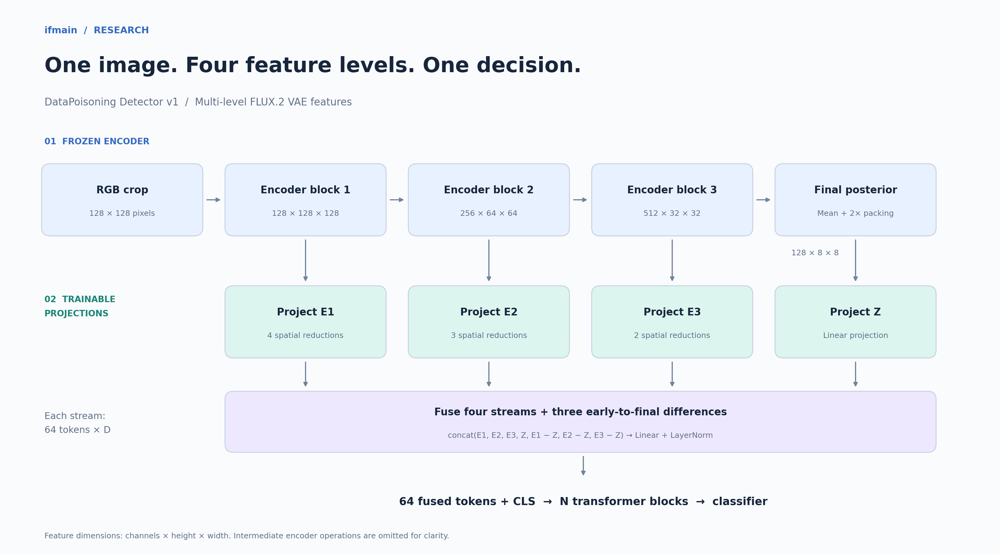
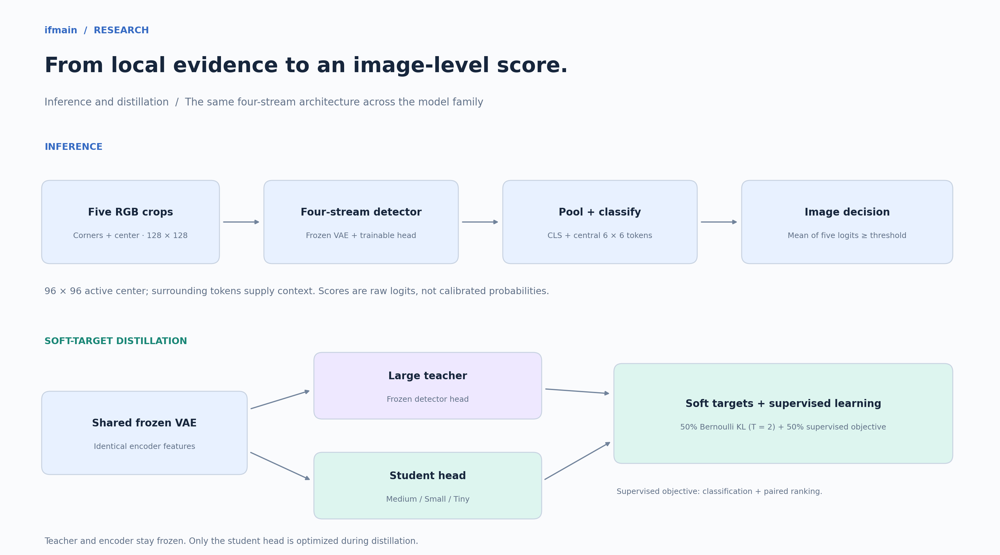
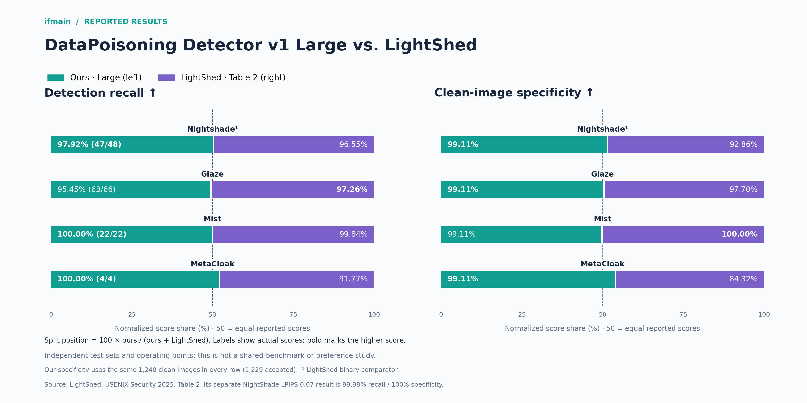
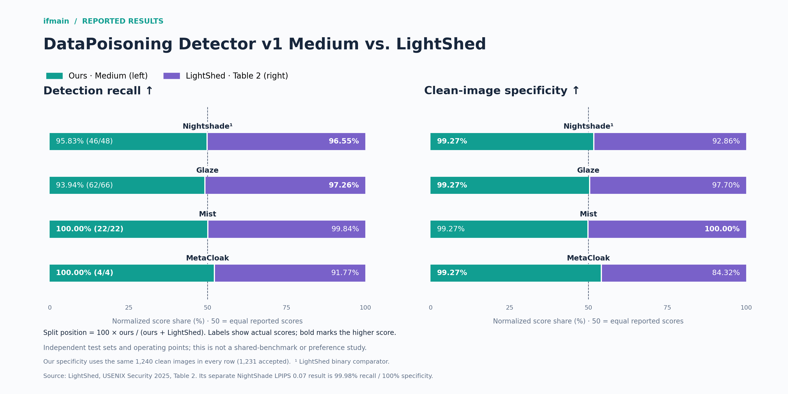
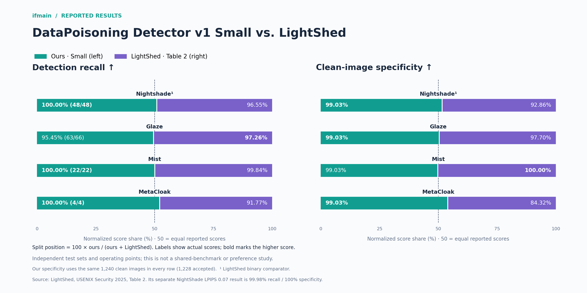

# DataPoisoning Detector v1

<!-- architecture-figures -->
## Architecture at a glance





Original diagrams for this release. Editable SVG versions: [architecture](assets/architecture.svg) · [inference and distillation](assets/inference-distillation.svg).
<!-- /architecture-figures -->


[Code and training](https://github.com/ifmain/datapoisoning-detector-v1) · [Evaluation reports](https://github.com/ifmain/datapoisoning-detector-v1/tree/main/reports/three_tap_run)

Install with `pip install -e .` (or `pip install -r requirements.txt`). For figure rendering, install `pip install ".[plots]"`. See [installation verification](docs/INSTALLATION.md). Run `python scripts/predict.py image.png --model ../hf-large --device cuda`. Training: `python scripts/train.py --help`; optional distillation uses `--teacher`, `--kd-weight 0.5`, `--temperature 2`.

The detector compares encoder blocks 1, 2 and 3 with the final posterior-mean representation of a frozen FLUX.2 VAE. Each stream is projected to an 8 × 8 token grid. The three early-to-final differences are fused with all four feature streams before transformer classification. Inputs are native-resolution 128 × 128 RGB crops with a central 96 × 96 active region. The VAE decoder and generative FLUX transformer are not used.

This run excludes CelebA-HQ from training, validation, test and patch caches. It contains 21,464 training, 1,257 validation and 1,446 test records. Large starts with newly initialized trainable parameters and the licensed frozen VAE encoder. Students learn from this new Large through temperature-2 Bernoulli KL soft-target distillation: 50% distillation and 50% supervised classification plus paired ranking. Checkpoint selection uses validation recall at a target false-positive rate of 1%, with ROC-AUC as the tie-breaker. A decline receives two additional recovery epochs unless a sustained overfitting signal is observed.

Image-level inference averages five crop logits. Scores are not calibrated probabilities. The revised test set is a filtered subset of the previous experiment, not a fresh blind holdout. These results must not be presented as the old experiment's measurements. Local Glaze performance is reported separately below because that subset previously exposed a failure.

| Variant | Total parameters | Trainable parameters | Status |
|---|---:|---:|---:|
| Large | 296,264,065 | 261,838,209 | Evaluated |
| Medium | 182,722,433 | 148,296,577 | Evaluated |
| Small | 82,635,137 | 48,209,281 | Evaluated |
| Tiny | 43,280,257 | 8,854,401 | Evaluated |

## Model family comparison

### Detection recall

Percentage of protected images correctly detected. Higher is better.

| Protection | Large | Medium | Small | Tiny |
|---|---:|---:|---:|---:|
| Nightshade | 97.92% (47/48) | 95.83% (46/48) | **100.00% (48/48)** | 95.83% (46/48) |
| Glaze | **95.45% (63/66)** | 93.94% (62/66) | **95.45% (63/66)** | **95.45% (63/66)** |
| Mist | **100.00% (22/22)** | **100.00% (22/22)** | **100.00% (22/22)** | **100.00% (22/22)** |
| MetaCloak | **100.00% (4/4)** | **100.00% (4/4)** | **100.00% (4/4)** | **100.00% (4/4)** |

### Clean-image specificity

Percentage of clean images correctly accepted as clean. Higher is better. Each model uses its own validation-selected threshold on the same clean-control pool.

| Evaluation pool | Large | Medium | Small | Tiny |
|---|---:|---:|---:|---:|
| Shared clean controls | 99.1129% (1229/1240) | **99.2742% (1231/1240)** | 99.0323% (1228/1240) | 99.1129% (1229/1240) |

### Distillation quality

All students use the newly trained three-tap Large teacher. No previous detector checkpoint is used. Teacher agreement measures matching decisions, not correctness.

| Metric | Large | Medium | Small | Tiny |
|---|---:|---:|---:|---:|
| Accuracy | 98.8935% | 98.7552% | 98.8935% | 98.8243% |
| Recall | 97.5728% | 95.6311% | 98.0583% | 97.0874% |
| Precision | 94.8113% | 95.6311% | 94.3925% | 94.7867% |
| False positive rate | 0.8871% | 0.7258% | 0.9677% | 0.8871% |
| ROC-AUC | 0.998555 | 0.997851 | 0.999010 | 0.996336 |
| Teacher decision agreement | 100% (self) | 99.4467% | 99.5851% | 99.5159% |
| Image-logit MAE (lower is better) | 0 (self) | 0.658140 | 0.638014 | 0.683860 |
| Recall change vs. teacher (pp) | 0 (self) | -1.941748 | 0.485437 | -0.485437 |

## Published comparison

| Large | Medium |
|:---:|:---:|
| [](assets/published-comparison-large.png) | [](assets/published-comparison-medium.png) |
| **Small** | **Tiny** |
| [](assets/published-comparison-small.png) | [](assets/published-comparison-tiny.png) |

Click a figure to view it at full size. The numerical tables below report the **Large** model.

### Detection recall

Percentage of protected images correctly detected. Higher is better.

| Protection | Our recall (detected/positive) | LightShed Table 2 recall |
|---|---:|---:|
| Nightshade (binary comparator) | **97.92% (47/48)** | 96.55% |
| Glaze | 95.45% (63/66) | **97.26%** |
| Mist | **100.00% (22/22)** | 99.84% |
| MetaCloak | **100.00% (4/4)** | 91.77% |

### Clean-image specificity

Percentage of clean images correctly accepted as clean. Higher is better. Large uses one shared clean-control pool.

| Comparison condition | Our clean specificity | LightShed Table 2 specificity |
|---|---:|---:|
| Nightshade (binary comparator) | **99.11%** | 92.86% |
| Glaze | **99.11%** | 97.70% |
| Mist | 99.11% | **100.00%** |
| MetaCloak | **99.11%** | 84.32% |

Published independent evaluations; bold marks the higher value in each row. LightShed reports method-specific operating points; ours uses a fixed validation-selected threshold. Its NightShade LPIPS 0.07 condition separately reports 99.98% recall / 100% specificity. [Source: LightShed, Table 2](https://www.usenix.org/conference/usenixsecurity25/presentation/foerster). No LightShed code, weights or gated dataset was used.

## Local Glaze check

| Variant | Detected / positive |
|---|---:|
| Large | 2/2 |
| Medium | 1/2 |
| Small | 2/2 |
| Tiny | 2/2 |

## License and data provenance

The author licenses the code and the rights they hold in the new model weights under Apache-2.0. The frozen BFL VAE component is Apache-2.0. This grant does not establish third-party rights in training images. Retained sources include VGGFace2 and WikiArt through CAT, robust-style-mimicry, XAI, Helen, Open Images, DiffVax and user-supplied data; their commercial permissions have not all been verified. See [the provenance report](https://github.com/ifmain/datapoisoning-detector-v1/blob/main/reports/three_tap_run/provenance.md).

## Citation

If you find our work helpful, feel free to give us a cite.
```bibtex
@misc{ifmain2026datapoisoningdetector,
    title = {DataPoisoning Detector v1: Multi-Level FLUX VAE Features for Protective-Perturbation Detection},
    url = {https://github.com/ifmain/datapoisoning-detector-v1},
    author = {{ifmain}},
    month = {October},
    year = {2026}
}
```

Selected protection and dataset references: [REFERENCES.bib](https://github.com/ifmain/datapoisoning-detector-v1/blob/main/REFERENCES.bib).

## Component layout

Each model repository stores the trained head in `detector/` and the frozen VAE encoder in `vae/`. Load the repository root with `dpdetector.load_detector`. See [component documentation](docs/COMPONENTS.md).
